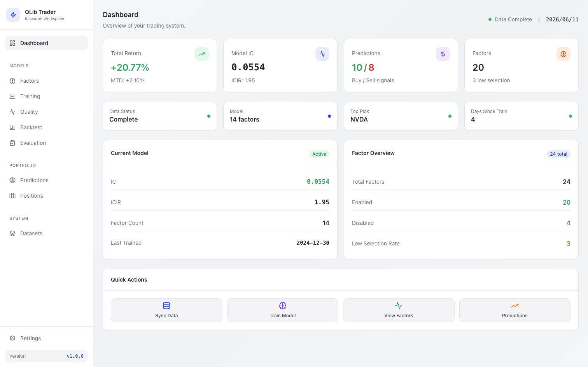
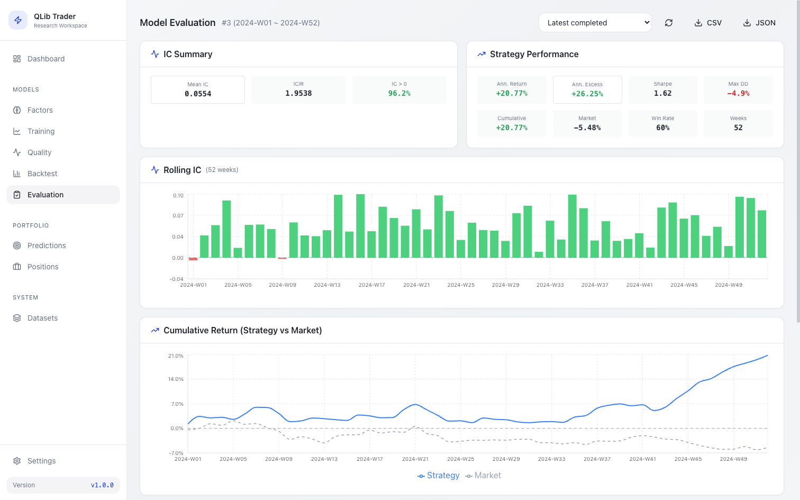
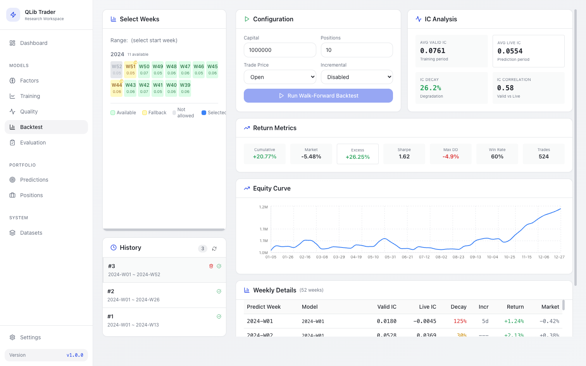
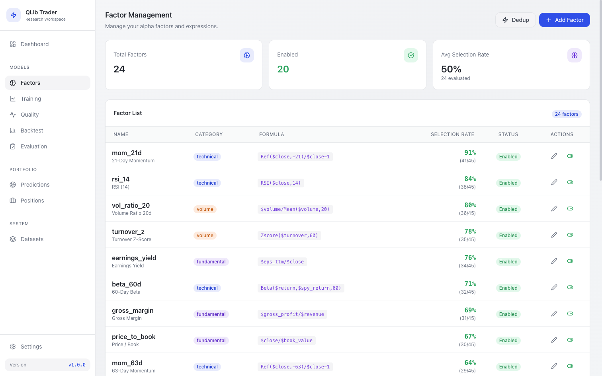

# QLib US Trader

<p align="center">
  <strong>A local-first US-equity quant research workspace — factors, model training, and walk-forward backtesting in one app.</strong>
</p>

<p align="center">
  
  
  
  
  
  
</p>

## Screenshots

<p align="center">
  
  
</p>
<p align="center">
  
  
</p>

<p align="center"><sub>Dashboard · model evaluation · walk-forward backtest · factor library — captured in <code>VITE_DEMO=1</code> sample-data mode.</sub></p>

> Want to see it yourself with no setup? Run the frontend in demo mode (`VITE_DEMO=1 npm run dev`) and the whole UI renders with sample data — no backend, no data sync, no model required. See [Demo mode](#demo-mode).

## What it is

QLib US Trader is a self-contained research workspace for building and evaluating
factor-based equity models on **US stocks**. It wraps Microsoft's
[Qlib](https://github.com/microsoft/qlib) and LightGBM behind a FastAPI backend and a
React dashboard, so the full loop — pull data → manage factors → train → backtest →
evaluate — lives in one local app.

It started as a conversion of the Taiwan-market project
[`Docat0209/qlib-tw-trader`](https://github.com/Docat0209/qlib-tw-trader) and has been
reworked into an English-first, US-only workspace with its own data path and dashboard.

## Features

- **Dashboard** — model IC/ICIR, return summary, prediction signals, and data-freshness at a glance.
- **Factor library** — manage alpha factors and their Qlib expressions, with selection-rate tracking and one-click de-duplication of correlated factors.
- **Model training** — weekly DoubleEnsemble (LightGBM) models with factor selection, driven from the UI.
- **Walk-forward backtesting** — pick a week range, run a true walk-forward backtest, and get an equity curve, IC analysis, return metrics, and a per-week breakdown.
- **Model evaluation** — rolling-IC and cumulative-return charts (strategy vs market), strategy stats, and CSV/JSON export.
- **US data path** — daily OHLCV, adjusted close, and a trading calendar via Yahoo Finance, plus a curated US large-cap starter universe.

## Tech stack

| Layer | Technologies |
|-------|-------------|
| Backend | FastAPI, SQLAlchemy, SQLite |
| Frontend | React 18, Vite, TailwindCSS, Recharts |
| Model | Qlib, LightGBM, DoubleEnsemble, Optuna |
| Market data | Yahoo Finance |
| Realtime | WebSocket |

## Quick start

### Docker

```bash
git clone https://github.com/toasterman234/qlib-us-trader.git
cd qlib-us-trader
cp .env.example .env
docker compose up --build
```

Services:

- Frontend: http://localhost:3000
- Backend API: http://localhost:8000
- Swagger: http://localhost:8000/docs

### Manual setup

```bash
python -m venv .venv
source .venv/bin/activate   # Linux/macOS
# .venv\Scripts\activate    # Windows

pip install -r requirements.txt
cp .env.example .env
uvicorn src.interfaces.app:app --reload --port 8000
```

Frontend:

```bash
cd frontend
npm install
npm run dev
```

Optional factor seeding:

```bash
curl -X POST http://localhost:8000/api/v1/factors/seed
```

## Demo mode

To explore the interface with realistic sample data and **no backend**, start the
frontend with the demo flag:

```bash
cd frontend
VITE_DEMO=1 npm run dev
```

In this mode the app mocks the API and renders a full set of sample factors, a trained
model, and a 52-week walk-forward backtest. It's how the screenshots above were
captured. All demo numbers are fabricated for illustration only.

## Environment

`.env.example` contains US-oriented defaults. Optional variables:

- `APP_TIMEZONE=America/New_York`
- `US_UNIVERSE_FILE=/absolute/path/to/tickers.txt`

`US_UNIVERSE_FILE` should contain one ticker per line, for example:

```text
AAPL
MSFT
NVDA
AMZN
GOOGL
META
```

## Architecture

The active runtime path:

- FastAPI backend
- React frontend
- US sync router (Yahoo Finance)
- SQLite + local model artifacts
- Qlib export + training path

The app is designed to remain a **local-first research workspace**, not a hosted
platform dependency.

## Status & scope

This is a research tool, not a production trading platform. The price-data path
(OHLCV / adjusted close / calendar) and the full factor → train → backtest → evaluate
loop work end to end on US equities. Some deeper fundamental dataset families
(valuation, ownership, institutional flow, short interest, revenue) are surfaced in the
UI as placeholders and are not yet fully wired. Nothing here is investment advice.

## Credits

Built on [Microsoft Qlib](https://github.com/microsoft/qlib) and originally derived from
[`Docat0209/qlib-tw-trader`](https://github.com/Docat0209/qlib-tw-trader).

## License

MIT. See [LICENSE](LICENSE).
